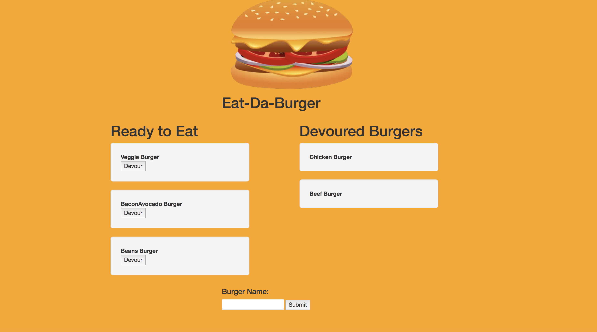

# Eat-Da-Burger Application

This web application is a restaurant app which allows users to create the burgers. When user's enter the name of burger they like to order and click on the submit button, burger will be displayed on the left side of page which is ready to be devoured. when the user clicked on the "Devour" button of each burger then it moved to right side of the page . Each burger is added and stored in database whether it is devoured or not.

## Technologies Used

* Mysql
* Node
* Express
* Handlebars
* ORM 